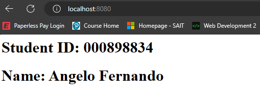
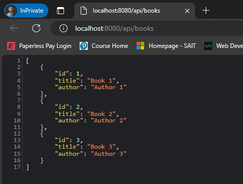

# Setting up a Docker Server for Dummies

In this guide for dummies I (Angelo Fernando) will be explaining a foolproof way to setup your own Docker server. 
I'll be explaining how to setup 2 types of webpages, one written in HTML, and one in NodeJS.  
This guide will assume that you are using a Windows PC. If you are using Linux, this guide is not for you.

## Prerequisites

- You must have Git installed

- You must have a GitHub account

- You must have Docker installed (this will also be explained, however)

- You must be technologically literate enough to do Chapter 0.1 & 0.2

## Chapter 0.1 - Installing Docker

### Step 1

- Download Docker from here: https://www.docker.com/products/docker-desktop/  
(Make sure to click **Download for Windows**)

### Step 2

- Keep clicking next to install Docker with default settings

- Restart your computer when prompted

### Step 3

- After restarting, accept the Docker User Agreement

## Chapter 0.2 - Setting up the Development Environment

### Step 1

- Fork this repository: https://github.com/eduluz1976/docker-challenge-template

### Step 2

- Use your preferred method to clone the repository to your pc (this will not be explained, use google)

### Step 3

- Open the repository in your preferred editor (this guide will assume VS Code)

## Chapter 1 - Setting up an HTML Server

### Step 1

- Open the `challenge1` folder

- Create a new folder called `public`

### Step 2

- Create an `index.html` file inside the folder

- Open the file and add your name and student id (specific tags don't matter)

### Step 3

- Create a `Dockerfile` (no extension) in the `challenge1` folder

- Place the following code in the file  
```Dockerfile
FROM nginx:latest
COPY /public /usr/share/nginx/html
EXPOSE 8080
```

### Step 4

- Open CMD and `cd` to the `challenge1` folder

- Build the Docker Image using the command `docker build -t dockerimage .`

### Step 5

- Using the same terminal from before, run `docker run -d -p 8080:80 dockerimage` to start the Docker server

- Open your browser and navigate to http://localhost:8080 to view the website

- The result should be something like this  


### Step 6

- Push your changes to your GitHub repository fork

## Chapter 2 - Setting up a NodeJS Server

### Step 1

- Download the `challenge2.zip` file

- Open the `challenge2` folder

- Extract `challenge2.zip` to the `challenge2` folder (do not create a new folder when extracting)

### Step 2

- Create a `Dockerfile` (no extension) in the `challenge2` folder

- Place the following code in the folder
```Dockerfile
FROM node:latest
WORKDIR /app
COPY . .
RUN npm install
EXPOSE 8080
CMD ["npm", "start"]
```

### Step 3

- Create a `docker-compose.yml` in the `challenge2` folder

- Place the following code in the folder
```yml
version: '3'
services:
	nginx:
		image: nginx:latest
		ports:
			- "8080:80"
		volumes:
			- ./nginx.conf:/etc/nginx/nginx.conf
		depends_on:
			- nodejs
	nodejs:
		build: .
		ports:
			- "3000:3000"
		volumes:
			- .:/app
```

### Step 4

- Create a `nginx.conf` in the `challenge2` folder

- Place the following code in the folder
```nginx
events {}

http {
	server {
		listen 80;

		location / {
			proxy_pass http://nodejs:3000;
			proxy_http_version 1.1;
			proxy_set_header Upgrade $http_upgrade;
			proxy_set_header Connection 'upgrade';
			proxy_set_header Host $host;
			proxy_cache_bypass $http_upgrade;
		}
	}
}
```

### Step 5

- Open CMD and `cd` to the `challenge2` folder

- Build the Docker image using the command `docker-compose up --build`

- Open your browser and navigate to http://localhost:8080/api/books

- The result should be something like this  


### Step 6

- Push your changes to your GitHub repository fork